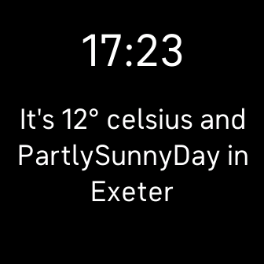

# sdk-weather-clock

Fitbit SDK example application which demonstrates the Companion Weather API.

The companion fetches weather data using the Companion Weather API and sends it
to the device using the File Transfer API. 

Find out more information on the
[Fitbit Developer Website](https://dev.fitbit.com).

## License

This example is licensed under the [MIT License](./LICENSE).
